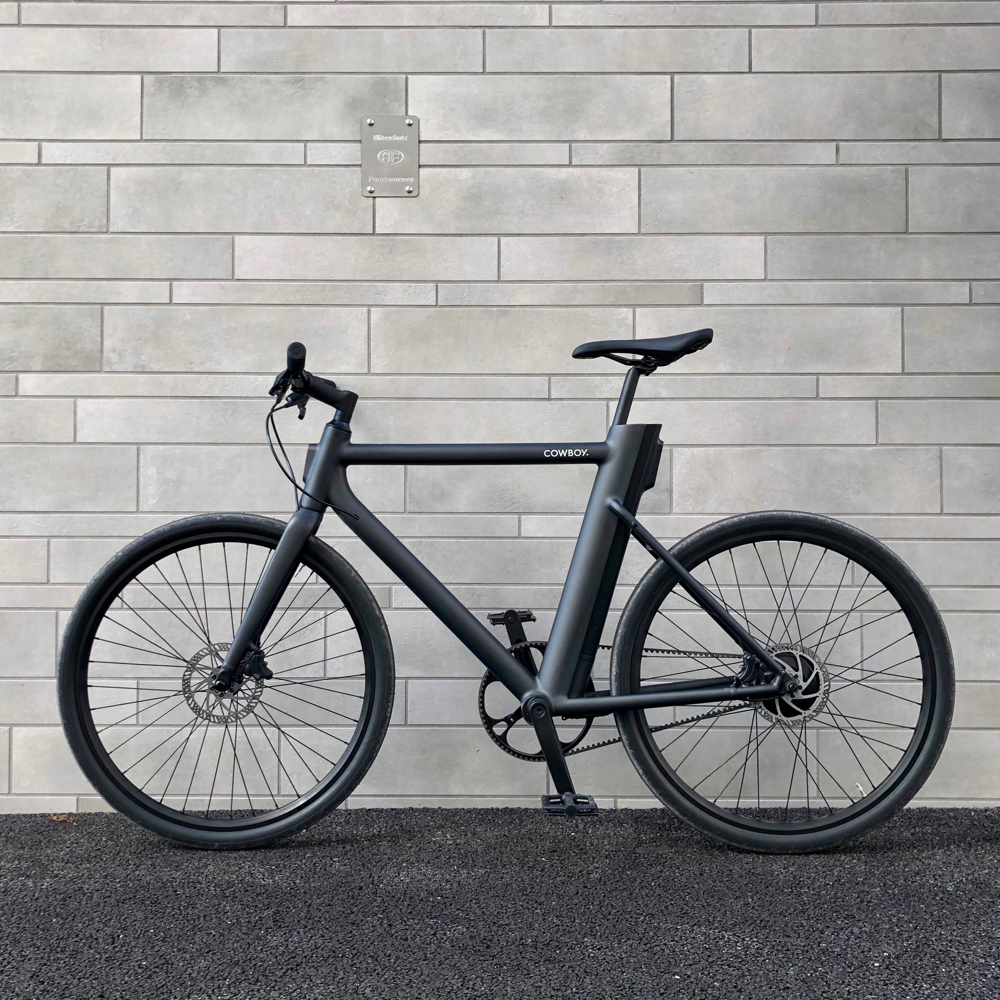
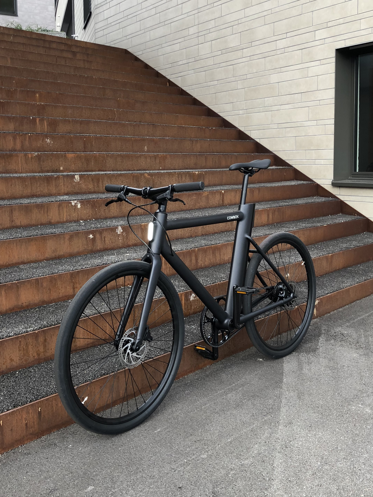
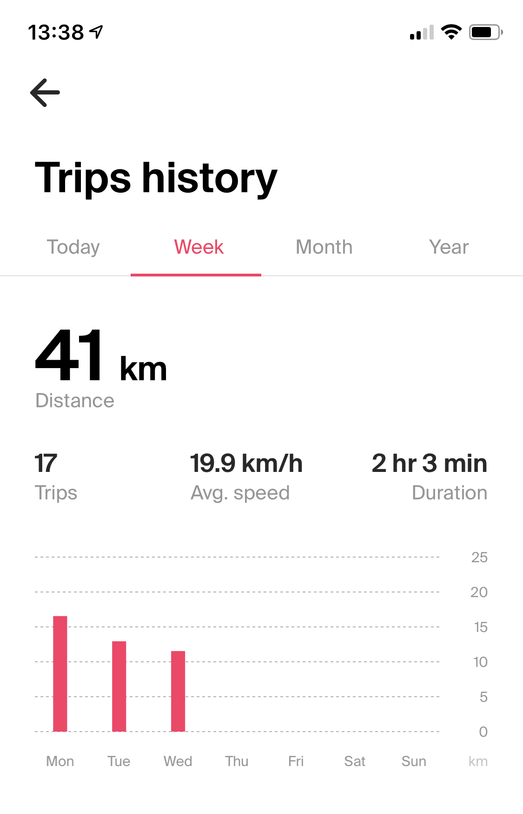

Last weekend I was able to pick up my Cowboy bike after pre-ordering it 6 weeks ago through [their website](https://cowboy.com). The bike comes fully assembled, all you have to do is attach the pedals and straighten the handlebar. All necessary tools are included and the instructions are clear. Even though the battery was almost empty there was enough juice left to pair it to my iPhone using the QR-Code printed on the back of the manual.

Their custom motor is very quiet and delivers smooth acceleration. Even though the fixed gear ratio of 3.1:1 is mostly a compromise between being too small or too large for any given terrain, you can comfortably ride at around 30 km/h on straights before you have to pedal like a madman. Inclines work well too, but the bike was not designed to take on our steep hills here in Switzerland.

The LED strips on the front and back of the bike look gorgeous and provide greatly increased visibility. In really dark riding conditions the strip on the front does not emit enough light by itself, which is why Cowboy includes an additional headlight that is attachable to the handlebar.

Cowboy's mobile app is very well designed and just works️™. It records the distance, duration, average speed, CO2 saved, and target location for every trip. It does not seem to record the whole tour. The data is displayed beautifully in _Trips history_.

You get to adjust a few settings of your bike, including _Auto-off timer_ (5 minutes to never) and _Speed limit_ (25 km/h or 30 km/h). The most impressive part of the app is the turn-by-turn navigation system that works with [OpenStreetMap](https://www.openstreetmap.org) data and integrates nicely with the dashboard which shows you things like your current speed, motor power output and remaining distance.

I'm very happy with my purchase and look forward to biking to work much more frequently. 🤠
