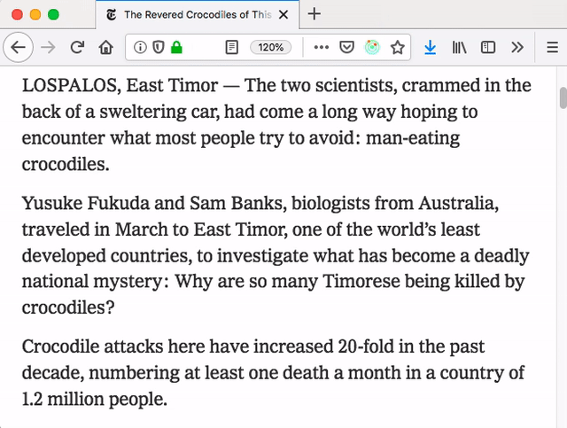

The [Dict.cc Translation](https://addons.mozilla.org/de/firefox/addon/dictcc-translation/) add-on for Firefox allows you to `ctrl+alt`-click on any word on a web page and instantly translate it through dict.cc. I love the speed and simplicity of this quite customizable extension and would definitely recommend it.

The source code is [available on Github](https://github.com/Lusito/dict.cc-translation).
