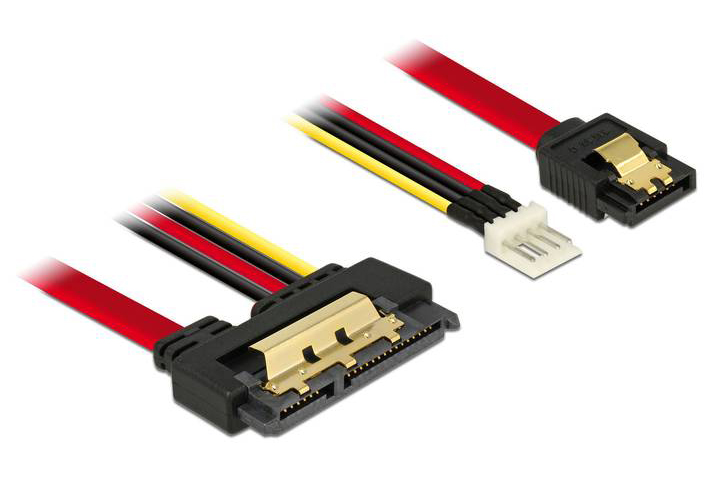
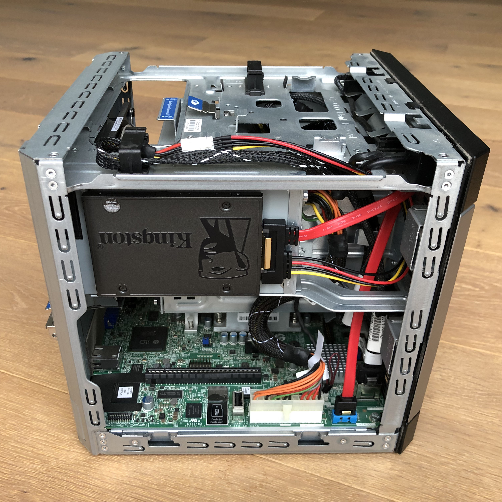
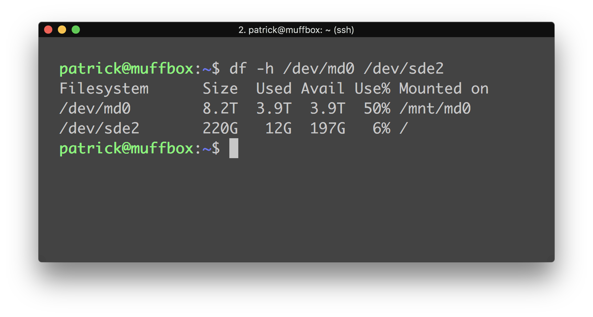

A while ago I got a HP MicroServer Gen8 along with four 3 TB HDDs as a place to store and encode my media. When setting up the RAID with the B120i I ran into the first issue - this hardware RAID controller is only able to create RAID 0, 1 or 10 logical volumes. In order to get the desired RAID 5 I had to resort to a software-based solution.

Since it's obviously not possible to boot from a software RAID I had to get an extra disk. At first I was using the SD card slot inside the server, though it turned out to be a horrible idea installing an OS like Ubuntu Server on it that wasn't optimized to run from an SD card. I noticed an empty SATA connector designated for the optical disk drive, went to my preferred tech website and order this specialized cable by Delock:

It allows me to draw power from the power chord originally intended for the ODD as you can see on this next photo:

The SSD is mounted _very_ professionally using double-sided tape.

So the rest is basically a walk in the park, right? Yeah, no. It is not possible to boot from the ODD bay on the MicroServer Gen8. There is a workaround though, you can create a RAID 0 with only the SSD in it on the B120i and then set that logical volume as the primary boot device. This works as you would expect it to, however there is a bug in the BIOS which makes the MicroServer forget all its logical volumes after a while. So every time I need to reboot the server I have to take it out of the closet, attach a monitor and keyboard, and setup the logical volume again.

There is a way of avoiding this tedious procedure. You could setup a bootloader on an SD card pointing to the ODD bay, but since fiddling around with this machine doesn't pay my bills, I think I will stick with my RAID 0 workaround.

