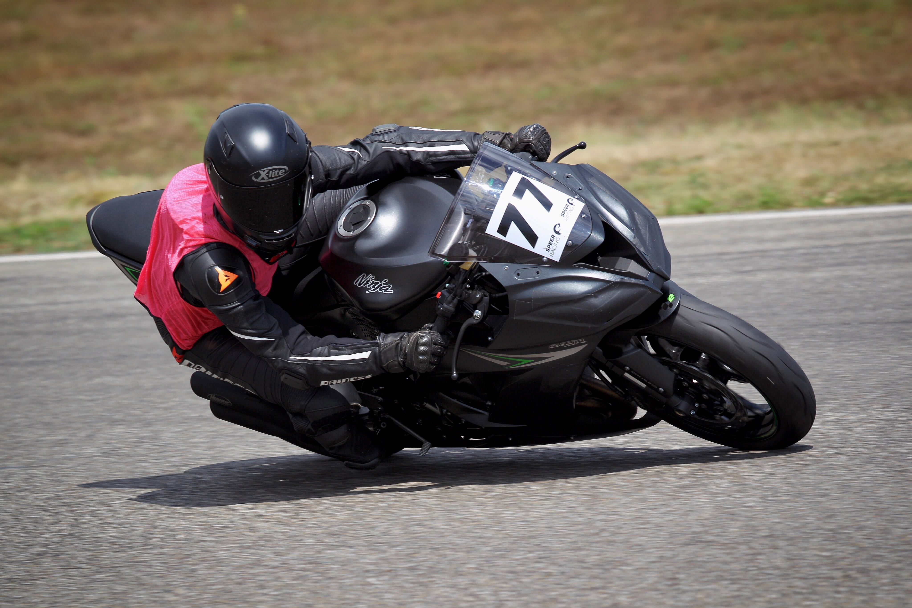
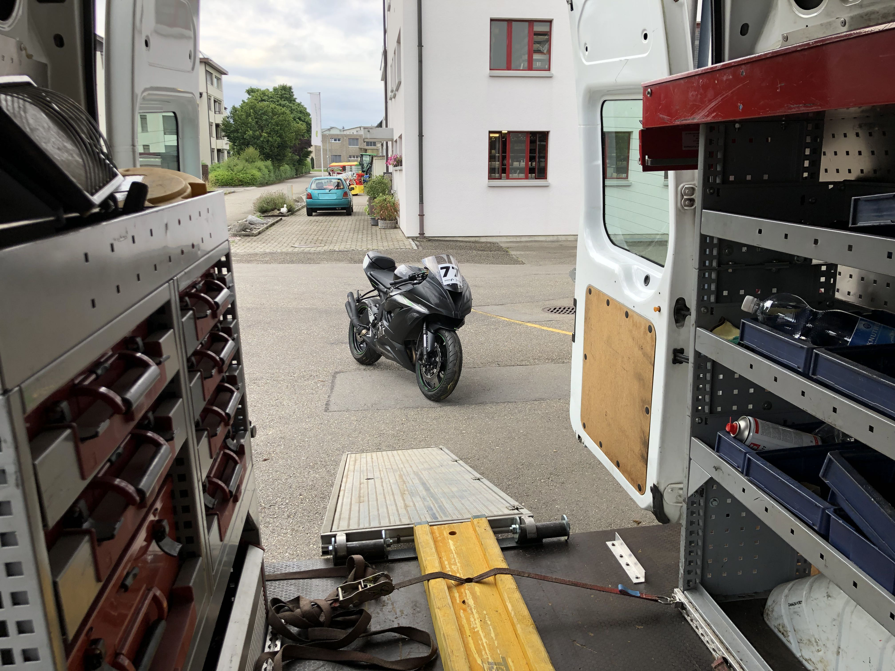

Some months prior to this photo I decided that I would have my first track day this year. At the end of July I took my Kawasaki ZX-6R 636 and went to [Circuit de l'Anneau du Rhin](https://www.rheinring.com/rennstrecken/rennstrecke-3-0-km/) which is the closest circuit to where I live. Thankfully I was able to borrow one of our company trucks to transport the bike. The guys there even built a little ramp for me!

[Speer Racing](https://www.speer-racing.de/startseite/), the track day organizer, wants you to make a few mandatory modifications to your bike before you get to race:

- **Remove number plate**: For security reasons.
- **Remove mirrors**: Always focus on what's ahead of you.
- **Put tape over the brake and head lights**: To not have glass shards all over the track if you crash.

They also want you to have lots of experience riding on the street (or track), all leather equipment and a bike with at least 80 PS. Given that I have that plus 163% of the required [Pferdestärke](https://en.wikipedia.org/wiki/Horsepower) I signed up for a training day with an experienced instructor.

I arrived at Anneau du Rhin at 08:00 in the morning. After a short briefing on weather and track conditions (which were perfect!) the people who booked a regular track day went on to have the first 20 minute session of the day. Meanwhile I had to choose a group (5 to 1) for my instructed sessions. I decided on 2, the second quickest one. It was a pretty bold choice if you take into consideration that I had zero racing experience at that point. Instructor Ricky introduced himself to our group of five people and a couple minutes later we were already lined up behind his awesome Ducati 1199 Panigale, ready to ride.

The warmup session started out pretty chill, though Ricky increased the speed every lap and I found myself struggling to keep up with the group towards the end. The second session already went better because we talked about the ideal racing line and proper gears during the 40 minute break. By the end of the day I improved so much that some of the others actually had troubles keeping up with _me_, which obviously made me feel super proud.

My tires (_Metzeler Sportec M5 Interact_) felt like they were glued to the tarmac. Next I am going to try their Racetec RR tires, just because I'm curious whether I feel a difference.

We had our last session at 16:40. Even though we skipped one right before lunch due to oil on the track, I was extremely tired. The next few days I had the sorest legs you could imagine, nevertheless feeling incredibly happy.

On to the next one!
