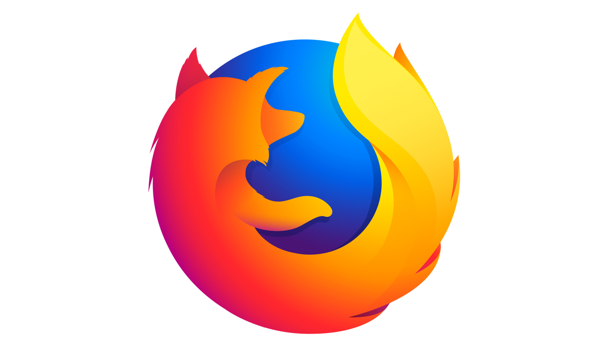
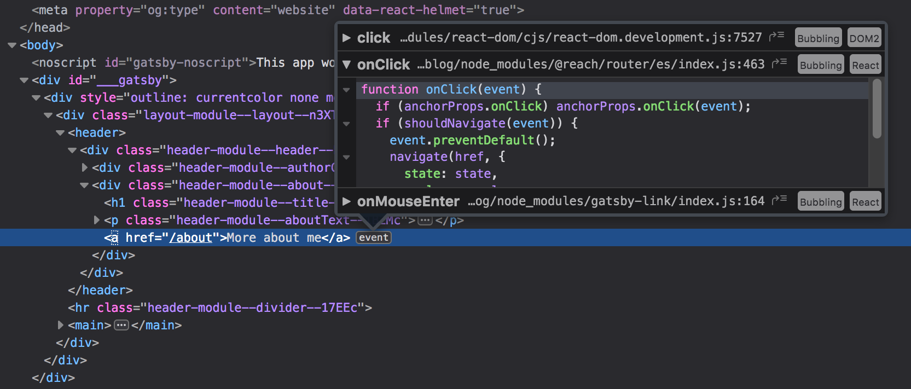
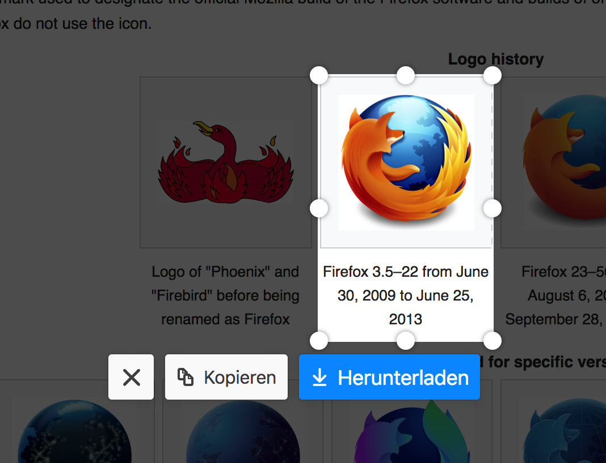

When Chrome was released to the public back in 2009 I was one of the first people to ditch Firefox in favor of it. It was new, quick and did everything I wanted it to do. However last month I changed my default browser back to Firefox Quantum, mostly due to being afraid of Google's monopoly on the web, partly because of some of the nice features Firefox brings with it in its recent versions.

Let me start this post by stating how **incredibly good** the Chrome Developer Tools are. I use them every day for multiple hours at my job and they are the number 1 reason I used Chrome for the past 10 years. Firefox has been catching up, but they are just not on the same level yet, which makes me keep Chrome installed on my machine for certain work. For example there is no way of seeing individual frames of a websocket connection in Firefox. It also does not let me throttle my CPU to simulate low-end devices and while it is able to throttle network speed, it cannot change it on the fly, meaning you need to completely reload a page when enabling/disabling network throttling.

The inspector tab to browse the DOM is pretty good in Firefox. I especially like the event inspection feature, which lets you immediately see all the event listeners on a DOM node and the respective attached function. This even works after minifying, as long as you provide source maps.

Another nice feature is the screenshot tool. While I love being able to `cmd+ctrl+alt+4` on macOS, having a tool included in your browser comes with the benefit of being able to quickly select elements on a web page to screenshot, which results in pixel-perfect PNGs.

## Googles controversial Manifest V3

Google released the [Google Chrome Extensions Manifest V3](https://docs.google.com/document/d/1nPu6Wy4LWR66EFLeYInl3NzzhHzc-qnk4w4PX-0XMw8/edit#) back in October 2018 where they are clearly saying they are going to restrict the blocking capabilities of the `webRequest` API. This change affects content and ad blockers massively, here are a few interesting quotes regarding the topic:

> Google Chrome users will continue to have access to the full content blocking power of the webRequest API in their browser extensions, **but only if they're paying enterprise customers**.

> The v3 draft, announced last October and still in flux, alarmed developers of Chrome extensions earlier this year when people began to understand that Google's plan to deprecate the webRequest API and other **proposed changes would break content and ad blockers**, privacy extensions, and other browser add-ons that rely on intercepting content before it gets displayed in the browser.

[– The Register (May 29, 2019)](https://www.theregister.co.uk/2019/05/29/google_webrequest_api/)

> In order for Google Chrome to reach its current user base, it had to support content blockers -- these are the top most popular extensions for any browser. Google strategy has been to find the optimal point between the two goals of growing the user base of Google Chrome and preventing content blockers from harming its business.

> The blocking ability of the webRequest API caused Google to yield control of content blocking to content blockers. Now that Google Chrome is the dominant browser, it is in a better position to shift the optimal point between the two goals which benefits Google's primary business.

> The deprecation of the blocking ability of the webRequest API is to gain back this control, and to further now instrument and report how web pages are filtered since now the exact filters which are applied to web page is information which will be collectable by Google Chrome.

[– uBlock Origin Author (May 26, 2019)](https://github.com/uBlockOrigin/uBlock-issues/issues/338#issuecomment-496009417)

## Google owns the internet

[StatCounter](http://gs.statcounter.com/browser-market-share#monthly-201811-201811-bar) reported Chrome's usage share at 61.75% in November 2018, [NetMarketShare](https://netmarketshare.com/browser-market-share.aspx?options=%7B%22filter%22%3A%7B%7D%2C%22dateLabel%22%3A%22Custom%22%2C%22attributes%22%3A%22share%22%2C%22group%22%3A%22browser%22%2C%22sort%22%3A%7B%22share%22%3A-1%7D%2C%22id%22%3A%22browsersDesktop%22%2C%22dateInterval%22%3A%22Monthly%22%2C%22dateStart%22%3A%222018-11%22%2C%22dateEnd%22%3A%222018-11%22%2C%22segments%22%3A%22-1000%22%7D) even reports 63.5%. Safari comes in second at 15.12% and 19.93% respectively, with Firefox hovering at around 5%.

Back in 2013 when Google suffered an outage affecting all of its services, [global internet traffic dropped 40%](https://www.cnet.com/news/google-goes-down-for-5-minutes-internet-traffic-drops-40/).

Like many others I don't believe that a single corporation having control over the entire internet is beneficial to its future, which is why I switched back to Firefox and started using [DuckDuckGo](https://duckduckgo.com/) as my primary search engine.

If you feel similar, maybe give [Firefox a try](https://www.mozilla.org/en-US/firefox/switch/)!
