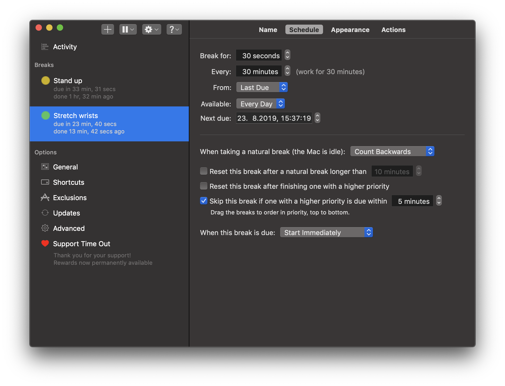

Sitting and typing on a keyboard for 10 hours a day can't be good for your health, which is why I wanted an app that reminds me to stretch my wrists and get up from the desk every now and then. Of course I could set alarms on my phone, but fixed alarms don't take natural breaks (time spent away from your computer) into account. So I went to the macOS App Store and browsed for apps that do that. And boy did I find one.

[Time Out](https://apps.apple.com/us/app/time-out-free/id402592703?mt=12) allows you to create custom break timers. You configure how often and how long you want your breaks to be and the app does the rest. It accounts for natural breaks by counting backwards or pausing the countdown. There are also a lot of visual options for the screen overlay during the break.

Core functionality is free, by becoming a paid supporter you get some more customization options and ensure future development. I especially like the trial mode of the app which allows you to try premium features for 1 hour every day.
