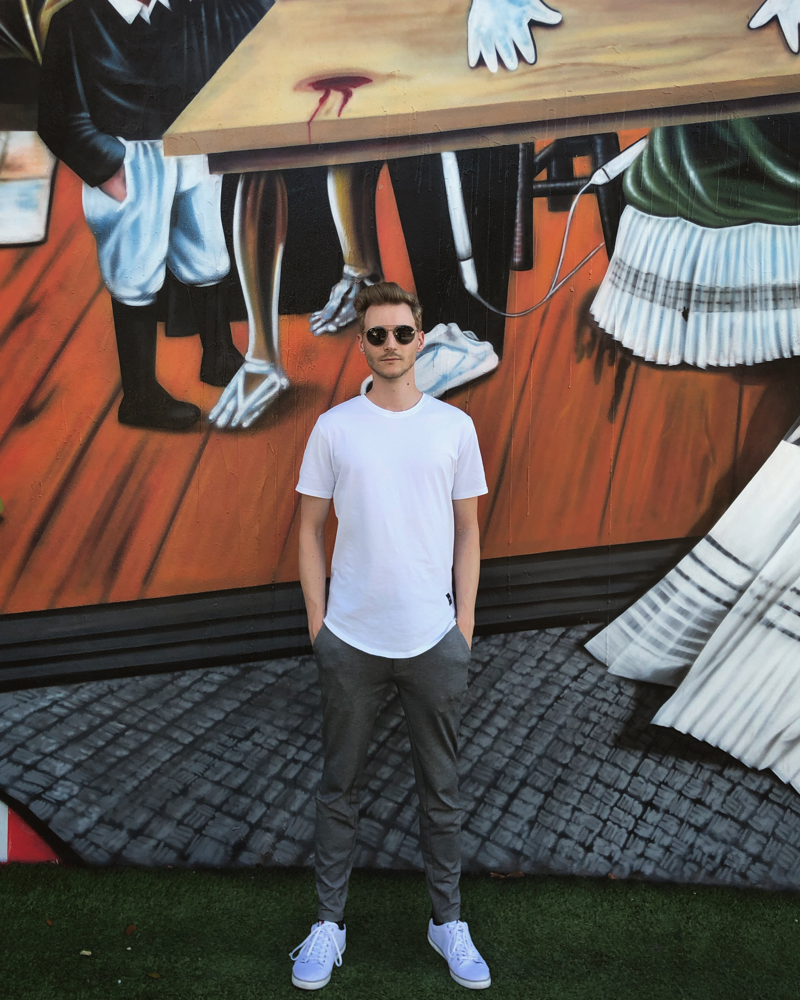

We decided to spend Christmas and NYE in Florida, USA! Our flight was leaving on December 23rd from Zürich and included a layover in Chicago before finally arriving in Miami. By then it was already 10 pm so we spent the first night in a hotel close by the airport. The next day we took an Uber to MIA Rental Car Center and picked up a car that I always thought was super cool ever since watching _The Fast and The Furious_ as a kid.

The first thing we did was stop at a T-Mobile store to get a prepaid SIM with 10 GB of data (and some free minutes, but who needs that lol) for like \$40. Then we started our journey to Key West!

## Key West

In Key West we stayed three nights at [The Southernmost Inn](https://thesouthernmostinn.com), which as you might have guessed already, is literally one of the southernmost hotels in the US.

We started by visiting Fort Zachary Taylor Historic State Park, which was reasonably interesting. Ernest Hemingway House was next where I bought 1952 short novel _The Old Man and the Sea_, a great read. Key West was also the first time we saw dolphins in real life!

## Homestead

After three days in Key West we drove up north to Titusville, which is right next to Orlando. We stopped for one day in Homestead and went snorkeling in Biscayne National Park. In the evening we went on to have the best lobster I ever had in [Yardie Spice Restaurant](https://www.tripadvisor.com/Restaurant_Review-g60739-d9790616-Reviews-Yardie_Spice_Restaurant-Homestead_Florida.html), because of a random recommendation by our boat captain in Biscayne.

## Titusville

There's nothing in Titusville, but it's really close to Kennedy Space Center, which was so commercial and crowded that I'm not even going to include any pictures.

## Blue Springs State Park

Blue Springs State Park is home to a spring that is one of the largest winter gathering sites for manatees in Florida. It was fascinating to see these huge animals moving seemly weightlessly through the water.

## Clearwater

Hiking in Clearwater turned out to be a bit tricky due to large pools of water on the trails. But there was an enormous bald eagle nest, so that was cool.

## Miami

Miami was dope. We spent seven days and nights in SLS Brickell, one of the nicer hotels I had the pleasure of staying in. If you're into art you need to go see [Pérez Art Museum Miami](https://www.pamm.org) designed by Swiss architecture firm Herzog & de Meuron. Wynwood Art District is a great place too.

And don't forget to drive to the Everglades to see some gators! 🐊

