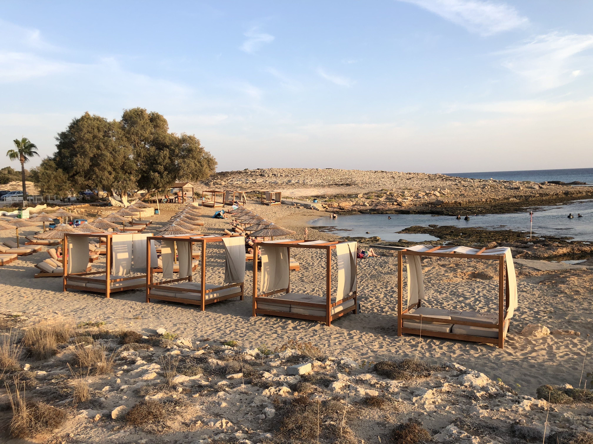
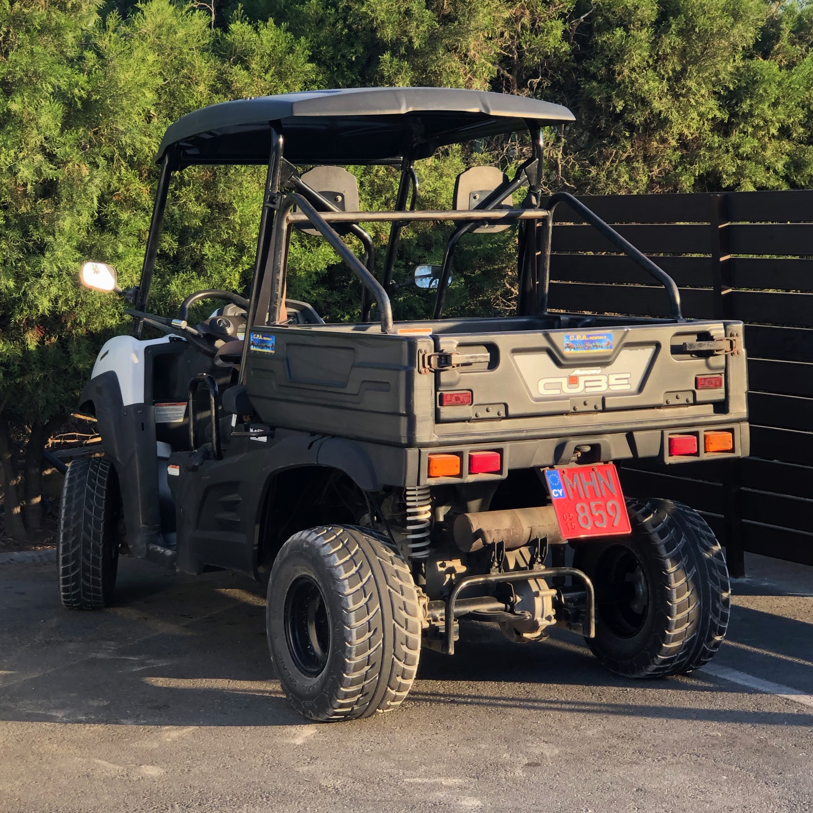

This October we flew to Ayia Napa for a week to visit my girlfriends sister. She recently completed her MSc and is now working and relaxing on the beautiful island in the Mediterranean sea for a while.

_Love Bridge, Ayia Napa_

Autumn is off-party-season in Cyprus. The weather is still very nice with temperatures at around 30° C, however there are less party tourists and more families with kids. What I maybe didn't realize before was that Ayia Napa is really meant for partying. There are very few local people, lots of hotels and clubs, and just a handful of good restaurants.

The beaches on the other hand are beautiful. In case you are allergic to large groups of people it is advisable to find one where there are not hotels around, like the one in the picture above. It is called Ammos Kambouri Beach and was ~1.5km away from our hotel, so we had a nice little walk there along the cliffs to the south of the island.

If you don't mind loud 250ccm two-stroke engines you should totally rent a buggy for a day. Ours only went up to ~40 km/h, but that's fine to see Cape Greco. When you're there, make sure to visit cavo greco environmental center which has an amazing exhibition showing the islands vegetation and animal life.

One last recommendation, reserve a table at Sage and order literally anything on the menu, it's all amazing.

Bye! 🌴
